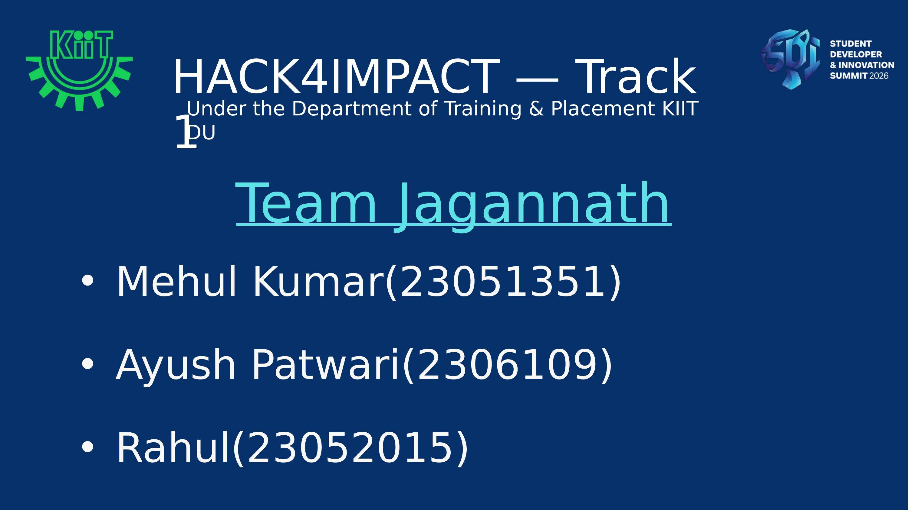
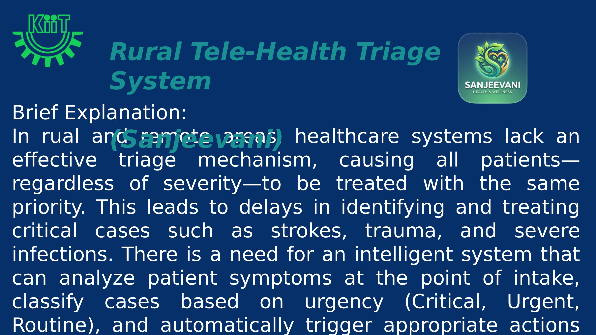
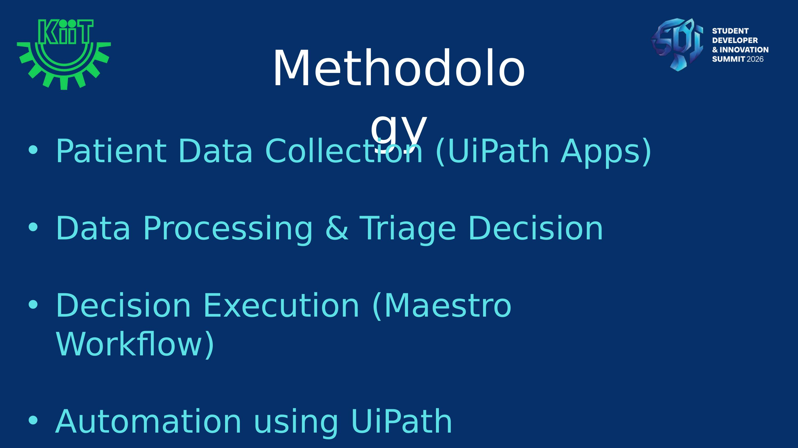
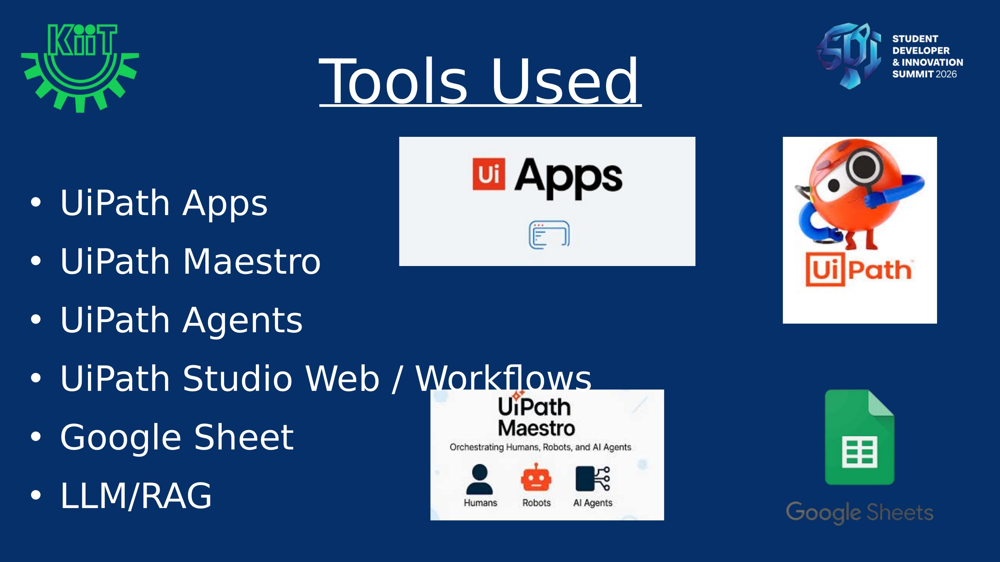
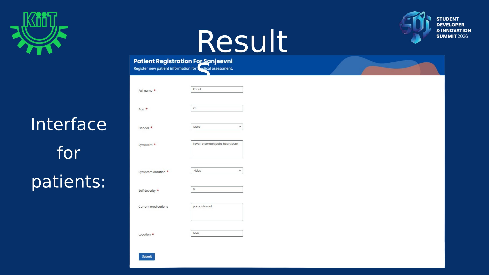
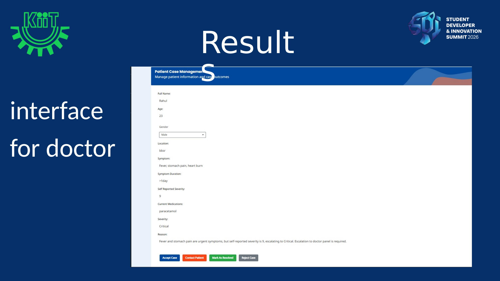
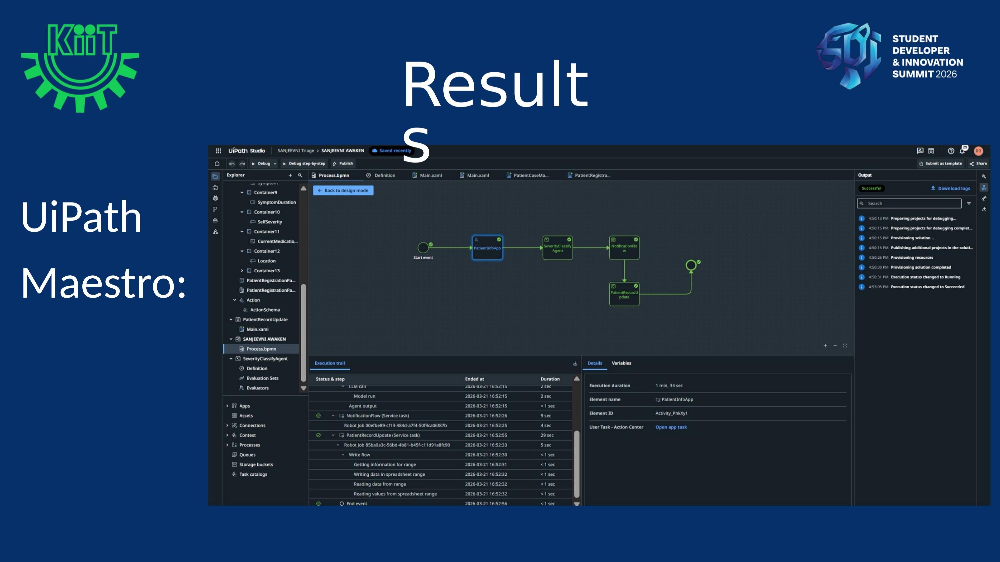
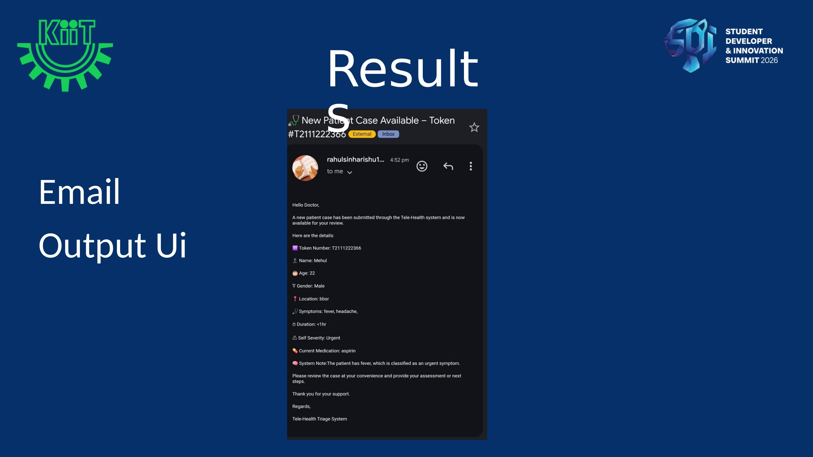
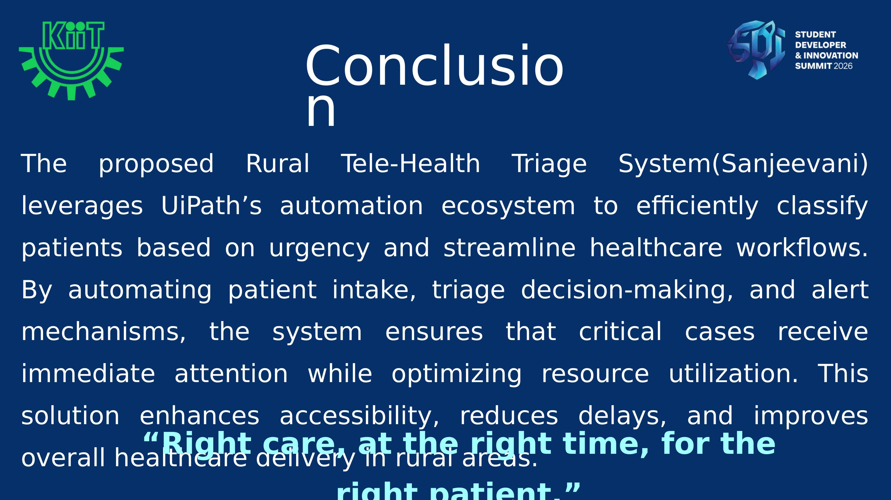

<div align="center">



<br>

# 🌿 Sanjeevani
### Rural Tele-Health Triage System

> *"Right care, at the right time, for the right patient."*


</div>

---

## 👥 Team Jagannath

| Member | Roll Number |
|--------|------------|
| Mehul Kumar | 23051351 |
| Ayush Patwari | 2306109 |
| Rahul | 23052015 |

---

## 🚨 Problem Statement



<br>

In **rural and remote areas**, healthcare systems lack an effective triage mechanism — causing all patients, regardless of severity, to be treated with the same priority.

This leads to **dangerous delays** in identifying and treating critical cases such as:
- 🧠 Strokes
- 🩸 Trauma
- 🦠 Severe infections

There is a critical need for an intelligent system that can:
1. Analyze patient symptoms at the point of intake
2. Classify cases based on urgency — **Critical**, **Urgent**, or **Routine**
3. Automatically trigger appropriate actions without requiring expert intervention

---

## 💡 Our Solution

**Sanjeevani** is an AI-powered, fully automated tele-health triage platform that:

- 📋 **Collects** structured patient data via a digital form
- 🤖 **Classifies** urgency using an LLM/RAG-powered agent
- ⚡ **Escalates** critical cases instantly via automated workflows
- 📊 **Empowers** doctors with a real-time case management dashboard

---

## 🔄 Methodology



<br>

### Pipeline Overview

```
Patient Form (UiPath Apps)
        ↓
LLM/RAG Triage Agent → Classifies: Critical / Urgent / Routine
        ↓
UiPath Maestro Workflow → Orchestrates response actions
        ↓
Doctor Dashboard + Email Notification
```

| Step | Component | Description |
|------|-----------|-------------|
| 1️⃣ | **Patient Data Collection** | UiPath Apps form captures name, age, gender, symptoms, duration, severity, medications & location |
| 2️⃣ | **Data Processing & Triage Decision** | LLM/RAG agent processes the data and classifies urgency |
| 3️⃣ | **Decision Execution** | UiPath Maestro orchestrates the workflow based on triage outcome |
| 4️⃣ | **Output & Monitoring** | Doctors receive email alerts; cases tracked on dashboard |

---

## 🛠️ Tech Stack



<br>

| Tool | Purpose |
|------|---------|
| **UiPath Apps** | Patient-facing intake form UI |
| **UiPath Maestro** | Workflow orchestration engine |
| **UiPath Agents** | AI agent for triage decision-making |
| **UiPath Studio Web** | Workflow design and automation |
| **Google Sheets** | Backend data storage & logging |
| **LLM / RAG** | Natural language symptom analysis & classification |

---

## 📸 Results & Screenshots

### 🧑‍⚕️ Patient Registration Interface



> Patients fill in their full name, age, gender, symptoms, symptom duration, self-reported severity, current medications, and location — then hit **Submit**.

---

### 👨‍⚕️ Doctor Case Management Interface



> Doctors see the full case details including AI-assigned severity and reasoning. Actions available: **Accept Case**, **Contact Patient**, **Mark As Resolved**, **Reject Case**.

---

### ⚙️ UiPath Maestro Workflow



> The Maestro orchestration view shows the full automation pipeline — from `PatientInfoApp` → `SeverityClassifyAgent` → `NotificationFlow` → `PatientRecordUpdate` — with live execution logs and status tracking.

---

### 📧 Automated Email Notification



> When a case is submitted, the doctor receives a structured email with token number, patient demographics, symptoms, duration, severity classification, and system reasoning.

---

## 🏁 Conclusion



<br>

The **Sanjeevani Rural Tele-Health Triage System** leverages UiPath's full automation ecosystem to:

- ✅ **Improve Accessibility** — Patients in remote areas submit cases digitally without travelling first
- ⚡ **Reduce Response Times** — AI triage classification happens in seconds
- 📈 **Scale Effortlessly** — Maestro workflows handle concurrent cases across any healthcare network
- 🎯 **Optimize Resources** — Doctors focus on what matters most — critical patients

---

<div align="center">

### Built with ❤️ by Team Jagannath
**Mehul Kumar · Ayush Patwari · Rahul**

*HACK4IMPACT Track 1 · Department of Training & Placement · KIIT DU · SDI 2026*

</div>
